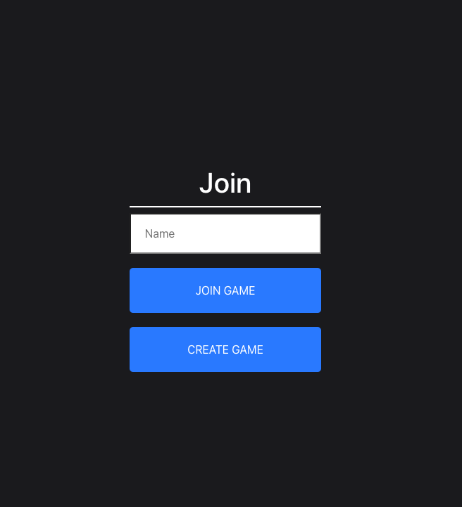
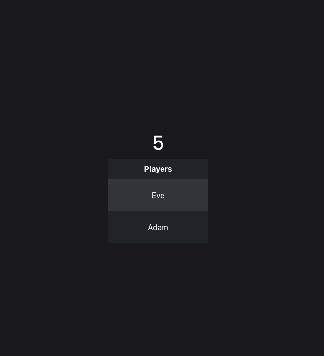
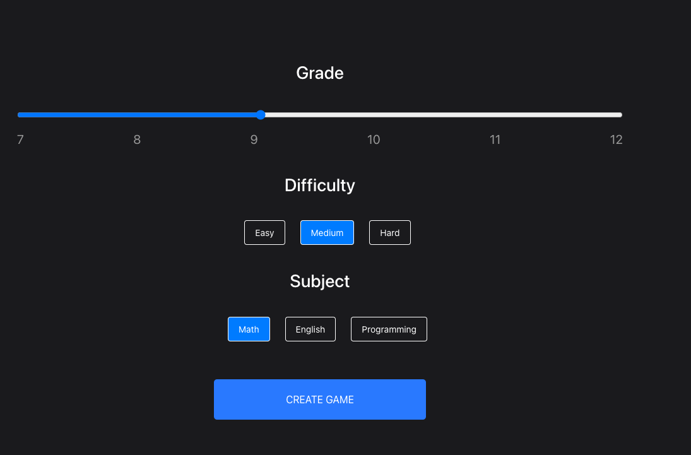
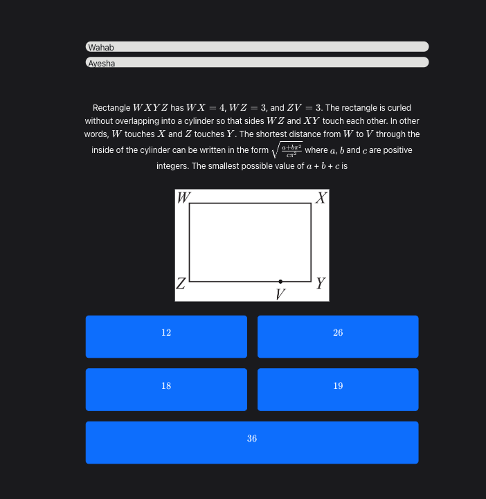

# Math Contest App

Welcome to the Math Contest Preparation App! This is a web application that provides a real-time multiplayer experience for math contest questions. The app includes three submodules:

- `mula-frontend`
- `mula-backend`
- `mula-store`

## Intention

The intention behind the Math Contest App is to make learning math problem-solving skills fun and interactive. We believe that students who enjoy learning are more likely to excel and retain knowledge. Our app combines the excitement of a real-time multiplayer game with challenging math questions to create a unique learning experience.

## Introduction

Math Contest Multiplayer Games is a web application that allows users to play past math contest questions in real-time multiplayer games. The application was designed to make learning math problem-solving skills fun and interactive. It has two modes of play: players can either play against strangers around the world or create a specialized game and train solo or with friends.

## Features

- Real-time multiplayer games that support LaTeX and questions with diagrams
- Ability to filter questions by difficulty, grade level, and contest section
- Two modes of play: play against strangers around the world or create a specialized game and train solo or with friends
- Create and join game rooms to play with friends or random players
- Score tracking within game rooms to keep track of each player's progress
- Easy to test and deploy locally
- Frontend built with React and backend built with Spring Boot using Kotlin
- Configured using Terraform and deployed on AWS using S3, RDS, EKS, and ECS

## Technical Details

The backend of the application is built using Spring Boot and Kotlin. The frontend is built using React. The application is deployed on AWS using Terraform. The infrastructure includes S3 for storing static assets, RDS for the database, EKS for Kubernetes management, and ECS for container management.

The real-time multiplayer game feature is implemented using Redis. Redis is used to manage game rooms and scoring within those rooms. When a player creates a game room, a new room is created in Redis with a unique room ID. When other players join the room, they are added to the Redis set associated with that room ID. Each room has a unique key in Redis, which stores the score of each player within the room.

## Local Development

To test and deploy the application locally, follow these steps:

1. Clone the repository
2. Install the required dependencies for the frontend and backend
3. Configure the environment variables for the backend (database connection, Redis connection)
4. Run the backend using Spring Boot
5. Run the frontend using `npm start`

## Screenshots

Here are some temporary URLs for screenshots of the Math Contest App:

## Join Game Page

## Waiting Room Page

## Create Game Page

## Question Page

